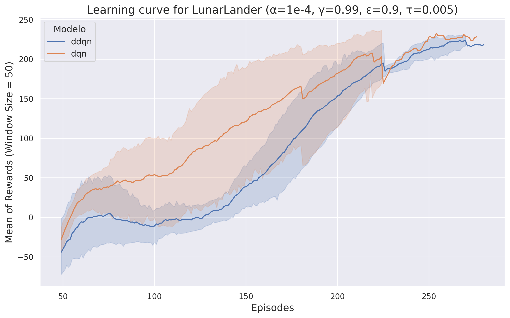
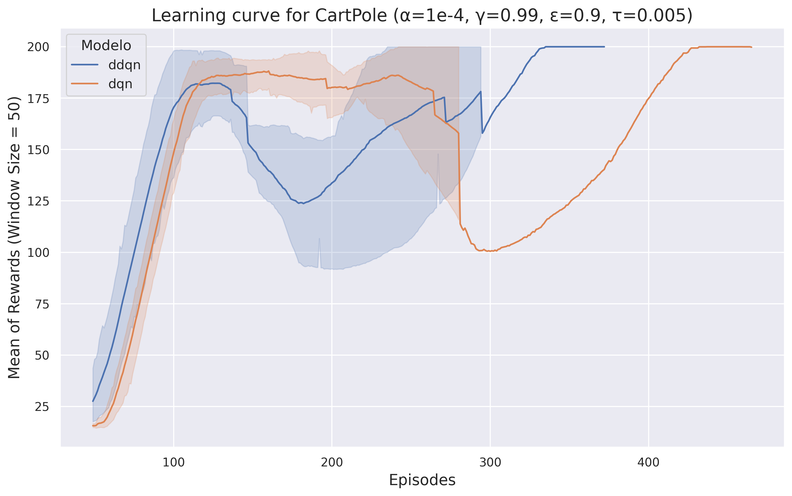
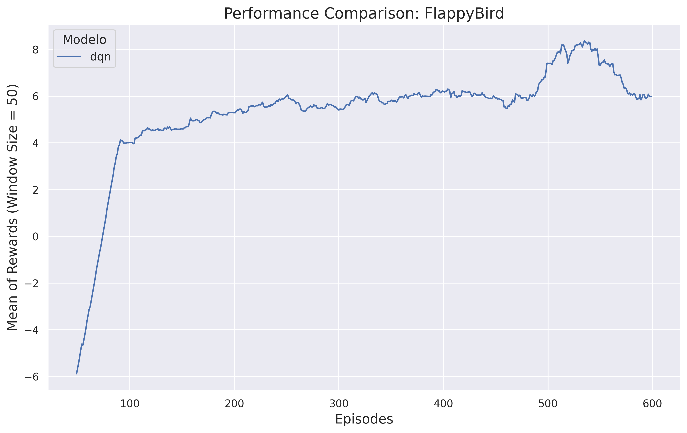
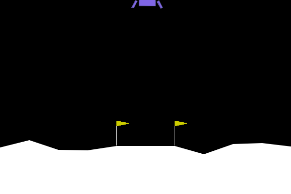
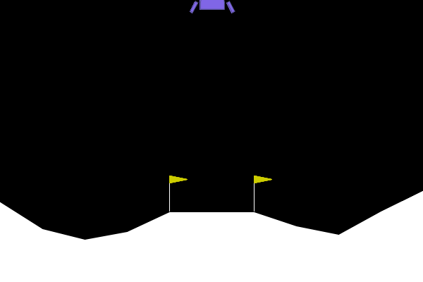
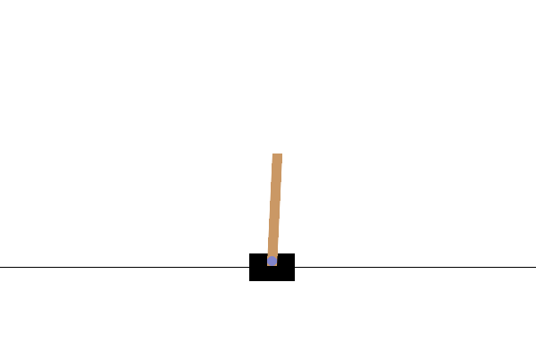

# Intermediate Reinforcement Learning Project - Ornithopter 

Welcome to the Intermediate Project of the Reinforcement Learning Course by the Ornithopter group, in which we tackled three different problems using Reinforcement Learning algorithms.

## Our Contributors

<table>
  <tr>
    <td align="center"><a href="https://github.com/RicardoRibeiroRodrigues"> <b>Ricardo Ribeiro Rodrigues</b></a> Developer</td>
    <td align="center"><a href="https://github.com/Pedro2712"> <b>Pedro Andrade</b></a> Developer</td>
    <td align="center"><a href="https://github.com/JorasOliveira"> <b>Jorás Oliveira</b></a> Developer</td>
    <td align="center"><a href="https://github.com/renatex333"> <b>Renato Laffranchi</b></a> Developer</td>
  </tr>
</table>

## Overview
In this project, we engage with the following environments:

* Lunar Lander from [Farama Foundation Gymnasium](https://gymnasium.farama.org/environments/box2d/lunar_lander/);

  

* Cart Pole from [Farama Foundation Gymnasium](https://gymnasium.farama.org/environments/classic_control/cart_pole/);

  

* Flappy Bird implemented by [Martin Kubovčík](https://github.com/markub3327/flappy-bird-gymnasium).

  

Our goal is to develop and evaluate the DQN and Double DQN algorithms on all environments listed above. Through iterative design and testing, our team seeks to optimize agents performance and compare learning efficiency.

## Algorithms
In this project, we have implemented both DQN and Double DQN algorithms.

In this project, we have implemented both DQN and Double DQN algorithms. 

### DQN (Deep Q-Networks)

DQN, or Deep Q-Networks, is a reinforcement learning algorithm that utilizes a neural network to approximate the Q-function. It selects actions based on the maximum Q-value predicted by the network. However, this approach can lead to overestimation of action values, affecting the learning process and resulting policies.

### Double DQN

Double DQN addresses the overestimation issue by employing two separate neural networks: one for action selection (policy network) and another for action evaluation (target network). By decoupling action selection from evaluation, Double DQN provides more stable and less biased estimates of action values, potentially leading to better-performing policies.

## Comparison: DQN vs Double DQN

By comparing these two algorithms, we not only gauged the impact of advanced techniques like experience replay on the learning efficiency and stability but also demonstrated the evolution of reinforcement learning strategies from basic Q-Learning to sophisticated architectures like DQN. The implementation of both algorithms provided valuable insights into the dynamics of reinforcement learning and its application in complex environments such as lunar landing.

### Learning Curves

The learning curve above demonstrates the agent's performance over time, measured in terms of average reward per episode. Initially, the agent struggles to achieve successful landings, often incurring penalties for crashes or excessive fuel consumption. Over time, as the agent learns from its experiences, we observe a positive trend in performance, with increased rewards indicating more successful and efficient landings.

### Agent Demonstrations

Animations of the two algorithms interacting with the environments.

#### Lunar lander

- DQN

  

  

- DDQN

  

#### CartPole

- DQN
  

  

- DDQN

  

#### FlappyBird

- DQN
  

  

- DDQN

  

**TODO: Conclusao sobre comportamentos.**

### Conclusion

It is clear that in both algorithms, the agents were able to learn and specialize in their tasks. However, the Deep Q-Network (DQN) outperformed Deep Q-Learning (DQL) since, in the comparison of the Reward vs. Episode curves, the DQN converged in far fewer episodes, sometimes even in half the number of episodes required by DQL, and also achieved a higher average reward than DQL.

The reason the Deep Q-Network (DQN) might perform better than basic Deep Q-Learning could be due to a single main improvements in DQN. DQN uses what's called a target network, which is a separate network that helps in making the learning process more stable. This feature helps DQN learn faster and achieve better results compared to traditional Deep Q-Learning.

## References

