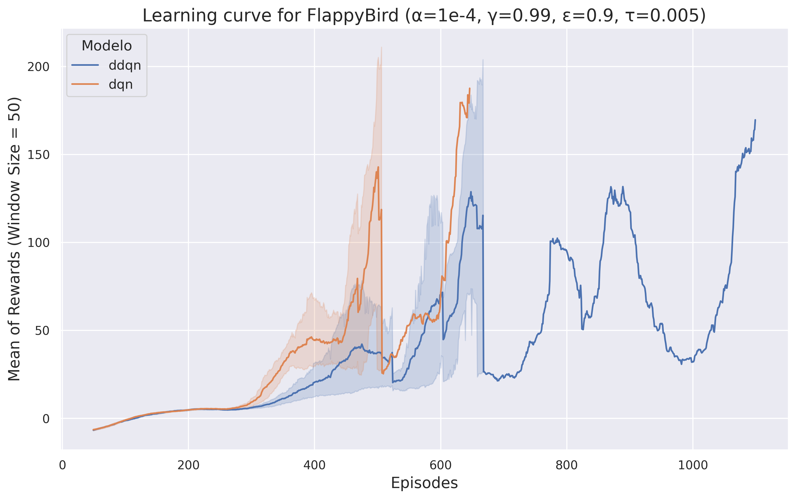

# Intermediate Reinforcement Learning Project - Ornithopter 

Welcome to the Intermediate Project of the Reinforcement Learning Course by the Ornithopter group, in which we tackled three different problems using Reinforcement Learning algorithms.

## Our Contributors

<table>
  <tr>
    <td align="center"><a href="https://github.com/RicardoRibeiroRodrigues"> <b>Ricardo Ribeiro Rodrigues</b></a> Developer</td>
    <td align="center"><a href="https://github.com/Pedro2712"> <b>Pedro Andrade</b></a> Developer</td>
    <td align="center"><a href="https://github.com/JorasOliveira"> <b>Jorás Oliveira</b></a> Developer</td>
    <td align="center"><a href="https://github.com/renatex333"> <b>Renato Laffranchi</b></a> Developer</td>
  </tr>
</table>

## Overview
In this project, we engage with the following environments:

* Lunar Lander from [Farama Foundation Gymnasium](https://gymnasium.farama.org/environments/box2d/lunar_lander/);

  

* Cart Pole from [Farama Foundation Gymnasium](https://gymnasium.farama.org/environments/classic_control/cart_pole/);

  

* Flappy Bird implemented by [Martin Kubovčík](https://github.com/markub3327/flappy-bird-gymnasium).

  

Our goal is to develop and evaluate the DQN and Double DQN algorithms on all environments listed above. Through iterative design and testing, our team seeks to optimize agents performance and compare learning efficiency.

## Algorithms
In this project, we have implemented both DQN and Double DQN algorithms.

### DQN (Deep Q-Networks)

DQN, or Deep Q-Networks, is a reinforcement learning algorithm that utilizes two neural networks: one for action selection (policy network) and another for action evaluation (target network). However, during action selection, the same network is used to evaluate the Q-values for the next state, which can lead to overestimation of action values.

### Double DQN

Double DQN also employs two separate neural networks: one for action selection (policy network) and another for action evaluation (target network). However, it addresses the overestimation issue by decoupling action selection from evaluation. During action evaluation, the target network provides more stable and less biased estimates of action values compared to the policy network, potentially leading to better-performing policies.

## Comparison: DQN vs Double DQN

Reinforcement learning algorithms have seen significant advancements in recent years, with Deep Q-Networks (DQN) and its variant, Double DQN, emerging as prominent contenders. DQN, pioneered by Mnih et al. (2015), revolutionized the field by leveraging deep neural networks to approximate Q-values, enabling successful learning in complex environments. Double DQN, proposed by van Hasselt et al. (2016), aimed to address overestimation biases inherent in DQN by decoupling action selection and evaluation. In this study, we investigate and compare the performance of DQN and Double DQN across three diverse environments: CartPole, LunarLander, and FlappyBird. By examining their efficacy in these environments, we aim to gain insights into the strengths and weaknesses of each algorithm in different scenarios.

The algorithms were trained five times each in all of the environments using a simple Fully-Connected neural network with three layers. For all trainings, an early stop policy was implemented to reduce training time. This policy dictates that training stops when the mean of the rewards from the **last 100 episodes** reaches a threshold considered sufficient for solving the environment. The threshold for stopping training is determined by the `env.spec.reward_threshold` variable provided by the Farama Gymnasium environments. In the case of the Flappy Bird environment, this variable was not defined. Due to time constraints (with training reaching over 12 hours), we set this threshold to 120, indicating satisfactory performance by the agent in playing the game.

### Learning Curves

The learning curves above effectively demonstrate the behavior of the algorithms.

In the Lunar Lander environment, DQN initially achieves positive rewards sooner and at a faster rate compared to DDQN. However, as episodes progress, DDQN gradually catches up in rewards, resulting in both algorithms achieving similar performance by the end. Notably, DQN tends to converge slightly quicker.

Conversely, in the CartPole environment, DDQN starts acquiring positive rewards earlier than DQN, which consistently lags behind. Although both algorithms encounter a dip in mean rewards after reaching a peak, highlighting the dangers of overconfidence in CartPole, DDQN demonstrates an ability to learn from mistakes and converge much faster than DQN.

In the Flappy Bird environment, training proves to be highly unstable for both agents, due to the randomness of the environment and the neural network's difficulty in generalizing behavior for the game. Because of the early stop mechanism explained before, the training stops at a certain threshold, leading to DQN, similarly to in Lunar Lander, finishing its training before DDQN, yet both managed to achieve the set average reward.

### Agent Demonstrations

Animations of the two algorithms interacting with the environments.

#### Lunar lander

- DQN

  

  

- DDQN

  

#### CartPole

- DQN
  

  

- DDQN

  

#### FlappyBird

- DQN
  

  

- DDQN

  

The behavior of agents also varies depending on the algorithm employed. DQN tends to exhibit more erratic behavior, characterized by twitchy movements that can be unsettling at times, giving the impression that the agent is on the verge of failure but manages to recover just in time. In contrast, DDQN agents tend to behave more cautiously, executing finer movements and adopting a more confident approach.

### Conclusion

Through rigorous training and evaluation, we observed distinct behaviors of DQN and Double DQN in each environment, demonstrating that, in both algorithms, the agents were able to learn and specialize in their tasks. In the Lunar Lander and Flappy Bird scenarios, DQN exhibited a faster initial learning rate, achieving positive rewards more quickly than Double DQN. However, Double DQN demonstrated its strength in producing more stable and less biased estimates over time, which, in the case of the Lunar Lander environment, allowed it to catch up and match DQN's performance by the end of training.

Contrastingly, the Cart Pole environment highlighted Double DQN's advantage from the outset, as it began acquiring positive rewards earlier and showed a remarkable ability to recover and learn from dips in performance more effectively than DQN. This indicates Double DQN's potential for better handling the challenges of overestimation and providing a more robust learning trajectory in certain contexts.

One of the critical insights from our project is the importance of algorithm selection tailored to the specific characteristics and challenges of the environment. While DQN might offer a quicker convergence in some scenarios, Double DQN's approach to reducing overestimation bias can lead to more stable and reliable learning in others. The choice between these algorithms should be informed by their inherent strengths and weaknesses, as well as the nature of the task at hand.

Moreover, the implementation of an early stop policy proved crucial in our training process, highlighting the need for efficient training strategies that balance computational resources with the achievement of satisfactory performance levels.

In conclusion, our project underscores the significance of continuous exploration and refinement in the field of reinforcement learning. The nuanced understanding gained from comparing DQN and Double DQN across varied environments enriches our toolkit for tackling complex problems. As we move forward, the insights and methodologies developed in this project will serve as valuable resources for future research and application in the evolving landscape of artificial intelligence.

## References
- Double Deep Q-Networks - https://ojs.aaai.org/index.php/AAAI/article/view/10295
- Deep Q-Networks - https://www.nature.com/articles/nature14236
